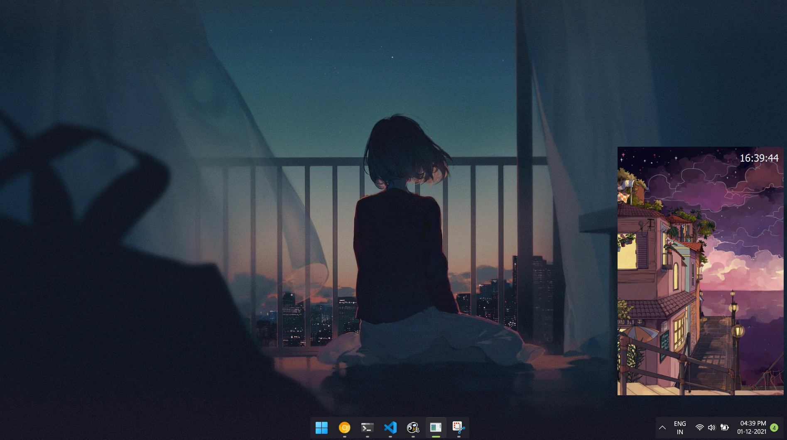

# Python 202020
A python made application to remind user to do 20-20-20; For 20 seconds, look at something 20 metres away every 20 minutes (to rest your eyes and keep them working well over time)


# Prerequisites
We use Qt for UI management stuff:
```python
pip install PyQt5
```

For building the desktop application:
```python
pip install pyinstaller
```

# Running
Assuming all the pip requirements were satisfied:
```python
python main.py
```

# Building

```python
pyi-makespec main.py
```
After making relevant modifications to the spec file:
```python
pyinsaller main.spec
```

# How does it look


